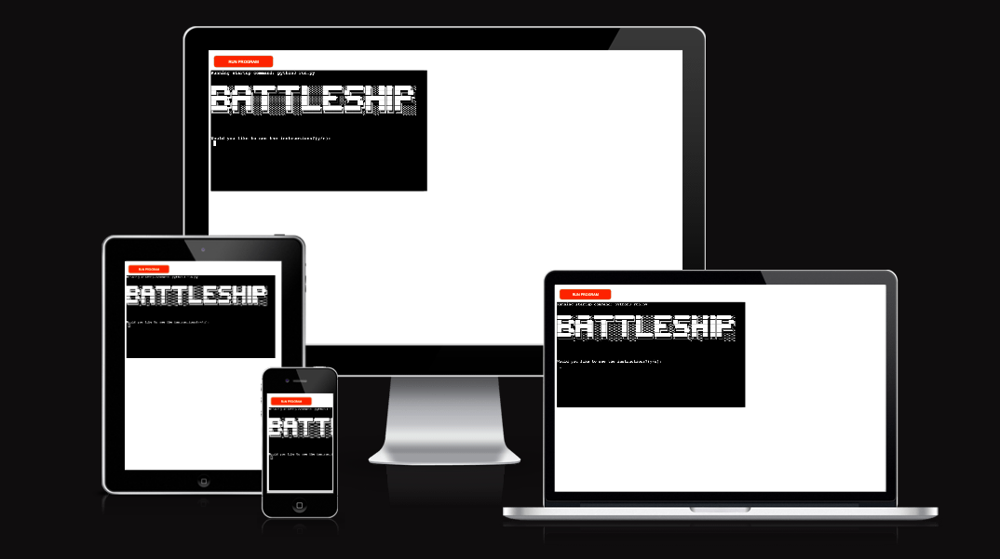
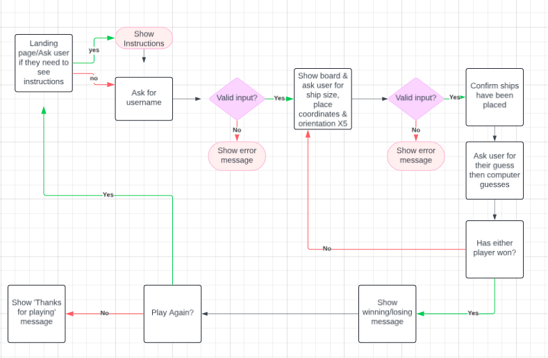
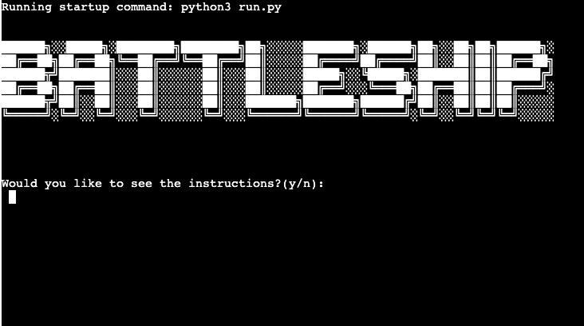
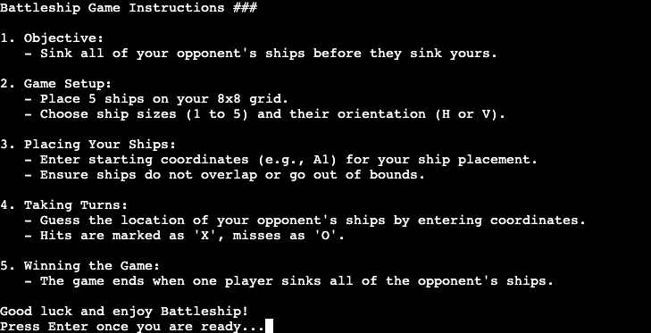
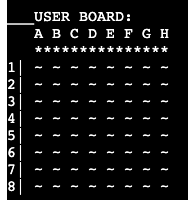
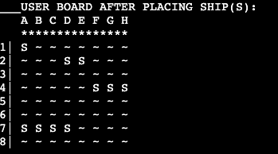
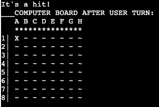
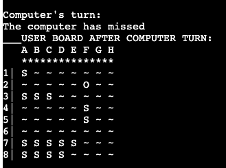
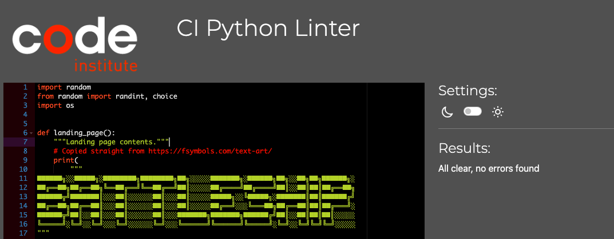

# Battleship

## Site Overview
Battleship is a two-player game where players aim to sink each other's ships by guessing their locations on an 8x8 grid. This version of the classic game has you competing against the computer in a grid-based battle to be the last one standing!

Live site: https://battleship123-ebf95228255d.herokuapp.com/

 

<!-- TOC end -->

  

### Lucid Chart

To have a clear idea of what I wanted to build, I created the below flowchart.

## User Stories

* As a user, I want to know what the game is immediately.
* As a user, I want to be able to read clear instructions to understand how to play.
* As a user, I want to have a good experience.

# Features

## Landing Page

The landing page shows the name of the game clearly.

## Instructions

The user is asked whether or not they want to view the insructions for the game. The instructions are clear and concise.

## Username

The user is asked for their name, input is validated.

## Display Board

The board is displayed for the user, you can see ships are marked by an 'S'.

 

## 'Hit' mark on board
A 'hit' is clearly marked with an 'X'.

## 'Miss' mark on board
A 'miss' is clearly marked with a 'O'.

## Winner messages
A winner message is displayed once either player has sunk all of their opponent's ships.

 

## Play Again

When the game is over, the player is asked if they would like to play again.

### Future features

 I would like to implement the following features in the future to allow for an improved user experience:
 - Sign up and Login feature to allow users a personalised experience.
 - Allow player to choose the board size
 - Implement a leaderboard using google sheets API
 
 

# Testing

## Feature Testing 

| Feature | Action | Result |
| ---|---|:---:|
| Landing Page Display | Confirm that the ASCII art logo appears as expected. | PASS |
| Display Instructions | Check that the game instructions are displayed correctly.  | PASS |
| Get User Name |Verify user can input their name and that it is properly validated.| PASS |
| Display Board |Ensure the board displays accurately for both players- ships hidden on the computer’s board.| PASS |
| Place User Ship | Validate that ships can be placed by the user with appropriate size, orientation, and positioning. | PASS |
| User Guess| Verify that valid hits (X) and misses (O) are marked correctly on the computer’s board.| PASS |
| Computer Guess|Confirm the computer can randomly guess positions on the user’s board,record hits and misses correctly.| PASS |
| Check Winner| Verify that the game correctly identifies and announces the winner when all ships of one player are sunk.| PASS |
| Clear Console| Check that the console is cleared when prompted.| PASS |
| Play Again| Ensure that the user can choose to play again or exit after the game ends.| PASS |

## Lighthouse Testing

The lighthouse testing was successful for all four ratings (Performance, Accessibility, Best Practices and SEO).

## Code Validation
### PYTHON

 

# Bugs

Debugging and problem solving was done consistently throughout the development process.

List of some issues that arose:

BUGS:
The code board[start_row][start_col + 'i'] has an issue because 'i' should not be in quotes. It is a variable, so simply write start_col + i.

after user chooses ship places it wasnt placing 'S' on board to show where ships are >> fixed this by mofifyng  start game function = game_board.display_board(game_board.user_board)

the game was asking if user wanted h/v when user picked 1 which is unnecessary, fixed this by: setting orientation to H automatically if 1 is selected 

computer ships were marked as '~' but when supposed to be hidden there were no spaces between cells where the ships were so you could tell their locations, updated with space to hide properly.

I was not fully familiar with the game so initially players could choose ship size 1 five times, implemented code to fix this to only allow one of each ship size per player.

 winner check is being triggered prematurely >> fix by separating the computer and users available sizes as once i placed all of the users ships the program would call check winner.

 play agian fun> thanks for playing and ask play again was in loop, fix by using elif statement with break

# Deployment

This project was deployed on Heroku. I will outline the steps to deploy the project below:

### Step 1:
Log into Heroku.
### Step 2:
Create new app.
### Step 3:
Type in the name of the app, which must be unique to work.
### Step 4:
Select your region.
### Step 5:
Click 'Create App' button.
### Step 6:
Click on the settings tab and go to 'Configure Vars' section.
### Step 7:
Click 'Reveal Config Vars', enter 'PORT' into the Key box and '8000' into the value box. Click the add button.
### Step 8:
Add buildpacks: Python and Nodejs in that order.
### Step 9:
Click on deploy tab.
### Step 10:
Connect GitHub account and search for repository name.
### Step 11:
Connect GitHub repository.
### Step 12:
Choose automatic deploy and select deploy.

# Credits

 
## Other

## Code / Educational Resources

# Acknowledgements 

This is project one, created for the Code Institutes Full Stack Web Developer (eCommerce) course. I would like to thank my cohort facilitator and the Code Institute team for their support.

Happy coding!

credits: YT video for formating board used some ideas > https://www.youtube.com/watch?v=cwpS_ac8uk0
code for random computer choice inspired by : https://discuss.codecademy.com/t/excellent-battleship-game-written-in-python/430605

BUGS:
The code board[start_row][start_col + 'i'] has an issue because 'i' should not be in quotes. It is a variable, so simply write start_col + i.

after user chooses ship places it wasnt placing 'S' on board to show where ships are >> fixed this by modifyng  start game function = game_board.display_board(game_board.user_board)

the game was asking if user wanted h/v when user picked 1 which is unnecessary, fixed this by: setting orientation to H automatically if 1 is selected 

computer ships were marked as '~' but when supposed to be hidden there were no spaces between cells where the ships were so you could tell their locations, updated with space to hide properly.

I was not fully familiar with the game so initially players could choose ship size 1 five times, implemented code to fix this to only allow one of each ship size per player.

 winner check is being triggered prematurely >> fix by separating the computer and users available sizes as once i placed all of the users ships the program would call check winner.

 play agian fun> thanks for playing and ask play again was in loop, fix by using elif statement with break