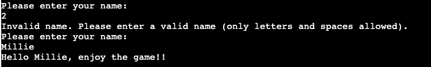
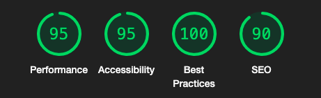

# Battleship

## Site Overview
Battleship is a two-player game where players aim to sink each other's ships by guessing their locations on an 8x8 grid. This version of the classic game has you competing against the computer in a grid-based battle to be the last one standing!

Live site: https://battleship123-ebf95228255d.herokuapp.com/

 

<!-- TOC end -->

  

### Lucid Chart

To get a clear idea of what I wanted to build, I created the flowchart below.

## User Stories

* As a user, I want to know what the game is immediately.
* As a user, I want to be able to read clear instructions to understand how to play.
* As a user, I want to have a good experience.
* As a user, I want clear prompts and error messages, so I know if I make an invalid move.
* As a user, I want the option to play again after each game, so I can try different strategies.

# Features

## Landing Page

The landing page shows the name of the game clearly and an option to view the instructions.

## Instructions

 The instructions are clear and concise and written in 5 points.

## Username

The user is asked for their name, the input is then validated.

## Display Board

The board is displayed for the user, you can see ships are marked by an 'S'.

 

## 'Hit' mark on board
A 'hit' is clearly marked with an 'X'.

## 'Miss' mark on board
A 'miss' is clearly marked with a 'O'.

## Winner messages
A winner message is displayed once either player has sunk all of their opponent's ships.

 

## Play Again

When the game is over, the player is asked if they would like to play again.

## Future features

 I would like to implement the following features in the future to allow for an improved user experience:
 - Sign up and Login feature to allow users a personalised experience.
 - Allow player to choose the board size.
 - Implement a leaderboard using google sheets API.
 
 

# Testing

## Feature Testing 

| Feature | Action | Result |
| ---|---|:---:|
| Landing Page Display | Confirm that the ASCII art logo appears as expected. | PASS |
| Display Instructions | Check that the game instructions are displayed correctly.  | PASS |
| Get User Name |Verify user can input their name and that it is properly validated.| PASS |
| Display Board |Ensure the board displays accurately for both players- ships hidden on the computer’s board.| PASS |
| Place User Ship | Validate that ships can be placed by the user with appropriate size, orientation, and positioning. | PASS |
| User Guess| Verify that valid hits (X) and misses (O) are marked correctly on the computer’s board.| PASS |
| Computer Guess|Confirm the computer can randomly guess positions on the user’s board,record hits and misses correctly.| PASS |
| Check Winner| Verify that the game correctly identifies and announces the winner when all ships of one player are sunk.| PASS |
| Clear Console| Check that the console is cleared when prompted.| PASS |
| Play Again| Ensure that the user can choose to play again or exit after the game ends.| PASS |

## Lighthouse Testing

The lighthouse testing was successful for all four ratings (Performance, Accessibility, Best Practices and SEO).

## Code Validation
### PYTHON

The code was tested on CI Python Linter, fixed all errors found. There are no errors as a result.

 

 

# Bugs & Fixes:

Debugging and problem solving was done consistently throughout the development process.

List of some issues that arose:

* The code board `board[start_row][start_col + 'i']` had an issue because 'i' should not be in quotes. It is a variable, so I fixed this by correcting the line of code to `board[start_row][start_col + i]`

* After the user chooses a ship position it wasnt placing 'S' on the board to show where ships were. I fixed this by modifying  start game function = `game_board.display_board(game_board.user_board)`

* The game was asking if the user wanted horizontal or vertical orientation when the user picked 1 for ship size which was unnecessary, fixed this by setting orientation to 'H' automatically if 1 is selected. 

* Computer ships were marked as water '~' but when they were supposed to be hidden there were no spaces between cells where the ships were so you could tell their locations, updated with space to hide them properly.

* I was not fully familiar with the game so initially players could choose ship size 1 five times, implemented code to fix this to only allow one of each ship size per player.

* The `check_winner` function was being triggered prematurely, I fixed this by separating the computer and users available ship sizes as once I placed all of the users ships the program would call check winner.

* The play again function has a message that asks the user if they would like to play again but this was stuck in loop, fixed this by using `elif` statement with `break`.

 

# Deployment

This project was deployed on Heroku. I will outline the steps to deploy the project below:

### Step 1:
Log into Heroku.
### Step 2:
Create new app.
### Step 3:
Type in the name of the app, which must be unique to work.
### Step 4:
Select your region.
### Step 5:
Click 'Create App' button.
### Step 6:
Click on the settings tab and go to 'Configure Vars' section.
### Step 7:
Click 'Reveal Config Vars', enter 'PORT' into the Key box and '8000' into the value box. Click the add button.
### Step 8:
Add buildpacks: Python and Nodejs in that order.
### Step 9:
Click on deploy tab.
### Step 10:
Connect GitHub account and search for repository name.
### Step 11:
Connect GitHub repository.
### Step 12:
Choose automatic deploy and select deploy.

# Credits

Youtube video for formatting board- used some ideas:  https://www.youtube.com/watch?v=cwpS_ac8uk0
 
Code for random computer choice inspired by : https://www.codecademy.com/resources/docs/python/random-module/choice
 
## Modules used

### Random
This module provides functions to generate random numbers and choices. It is used in the game to randomly place ships for the computer and to generate random guesses for the computer's turn.

### OS
This module provides a way to use operating system-dependent functionality. In this game, it is used to clear the console screen.

## Other
[Lucid Charts](https://www.lucidchart.com/)
 
[Am I Responsive](https://ui.dev/amiresponsive)
 
[ACSII Art](https://www.textartcopy.com/simple-text-art.html)

# Acknowledgements 

This is project three, created for the Code Institutes Full Stack Web Developer (eCommerce) course. I would like to thank my cohort facilitator and the Code Institute team for their support.